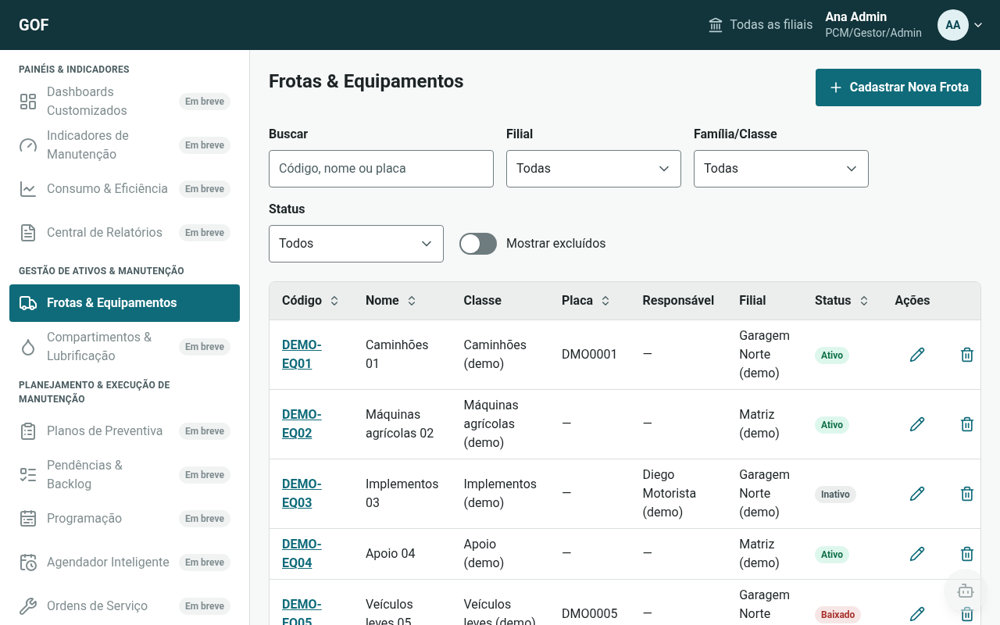
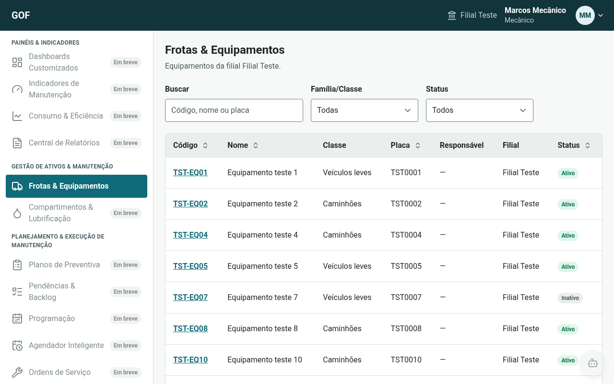
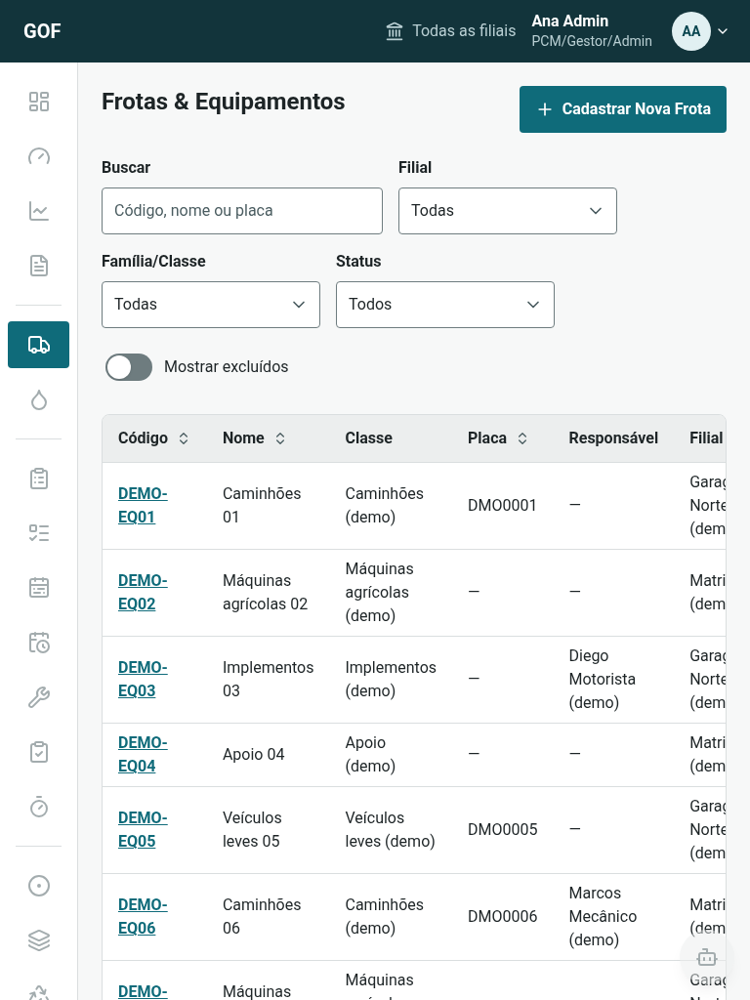
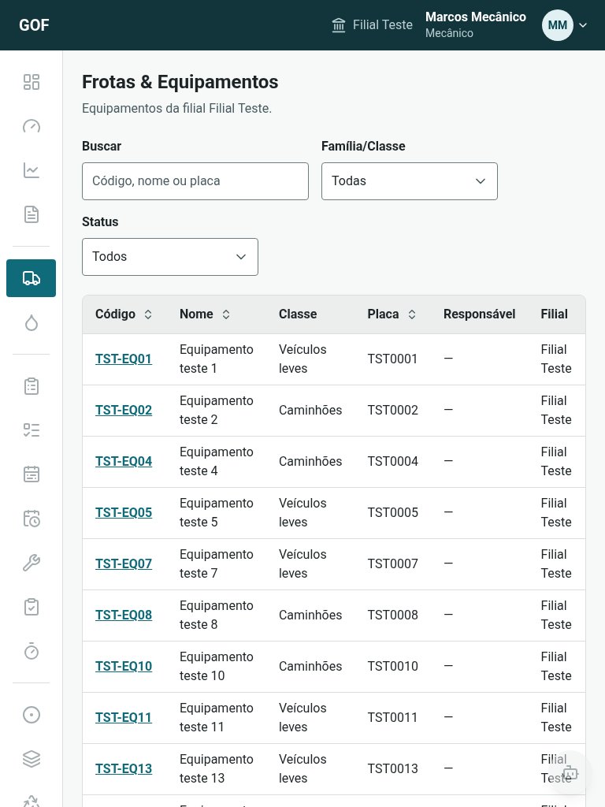
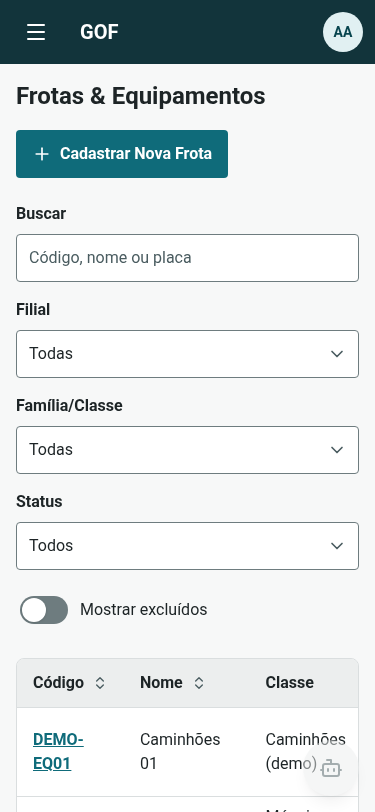
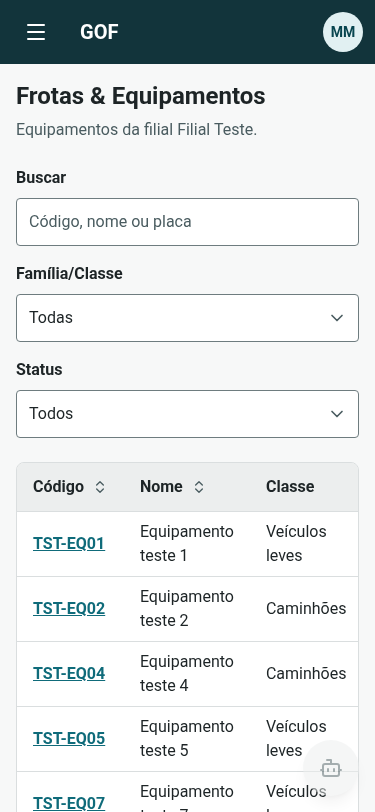

# Evidências da Fase 1

Documento do gate da Fase 1 (spec, seção I). A consolidação final é da F1-20; cada área mantém a
sua seção.

## Frontend (F1-21 a F1-31, F1-33a, F1-35, F1-36; gate F1-29)

Gerado em 2026-10-10, na branch `feat/f1-29-frontend-quality`, a partir do develop `d17a03b`.

### `npm run ci` (gate)

Rodado no container `node:24.21.0-alpine`, em `frontend/`. Saída 0.

| Etapa | Resultado |
|---|---|
| ESLint (`--max-warnings=0`, inclui jsx-a11y, react-hooks e `no-explicit-any`) | 0 erros, 0 warnings |
| Prettier (`--check`) | todos os arquivos formatados |
| TypeScript (`tsc -b`, `strict`, sem `any` implícito) | 0 erros |
| Vitest + cobertura (`test:coverage`, thresholds de 70%) | 51 arquivos, 471 testes verdes |
| Build (`tsc -b && vite build`) | ok |
| Bundle inicial (`check:bundle`, limite 500 kB) | 190,09 kB (JS 142,8 kB gz + CSS 5,7 kB gz + fontes woff2 41,6 kB) |

### Cobertura (Vitest, `src/`)

Relatório completo em `frontend/coverage/` (html e json-summary, gerado pelo `npm run test:coverage`, fora do git).

| Métrica | Cobertura | Gate |
|---|---|---|
| Linhas | 97,69% (1230/1259) | ≥ 70% |
| Statements | 96,40% (1342/1392) | ≥ 70% |
| Funções | 96,68% (496/513) | ≥ 70% |
| Branches | 90,76% (1170/1289) | ≥ 70% |

### Acessibilidade, toque e teclado

- **axe, 0 violações:** Login, Equipamentos (shell + lista e o Drawer 360°) e Parâmetros, em `src/quality/a11y.test.tsx`. Cada tela e componente também tem o seu teste com axe.
- **Alvos de 48px:** `src/components/ui/tap-min.test.tsx` e asserções `min-h-12 min-w-12` nos testes das telas.
- **Espaçamento ≥ 8px entre alvos (G.1):** `src/quality/spacing.test.tsx` verifica shell desktop e mobile (com o menu aberto), toolbar e ações de tabela de Equipamentos, formulário de equipamento, modal de cadastro, Painel de Parâmetros e Login. A prova negativa (sem o `gap-2` das ações de linha) falha.
- **Teclado:** Login, menus, abas, Drawer (foco preso, Esc, foco devolvido), Wizard/Stepper, Toast e Select, além do RadioGroup do Painel de Parâmetros (conferido com teclas reais no Chrome nos smokes).

### Segurança das dependências (`npm audit`)

0 high e 0 critical. Os 2 alertas moderados do `react-router` 6 não têm correção na linha 6 (só na 7.18); a decisão e a mitigação (`safeNext`, com testes) estão no [ADR-0002](adr/0002-frontend-stack.md#risco-react-router-6-npm-audit).

### Sessão

Se o `/auth/me` falhar logo após um login bem-sucedido, o token recém-emitido é revogado (`POST /auth/logout` com ele, best effort) antes de o erro aparecer, e nada vai para o storage (`auth.test.tsx`).

### Capturas do shell (API real)

Tela inicial (Frotas & Equipamentos) contra a stack local, com usuários temporários removidos depois. O admin vê todas as filiais, o filtro de filial e as ações de escrita; o mecânico vê só a própria filial, sem filtro de filial nem escrita, e a sidebar segue as permissões dele.

| Largura | Admin | Mecânico |
|---|---|---|
| 1280 px (sidebar fixa) |  |  |
| 768 px (sidebar em ícones) |  |  |
| 375 px (menu no drawer) |  |  |

### Smokes contra a API real (por tarefa)

Cada tela foi validada contra a stack local antes do merge. Os registros criados nos testes usaram prefixo próprio e foram removidos, e os dados do usuário não foram alterados (conferido com snapshot ou assinatura antes e depois).

| Tarefa | Resultado |
|---|---|
| F1-30 Unidades, Centros de Custo, Famílias | 35/35 |
| F1-31 Colaboradores e Usuários | 19/19 |
| F1-25 Listagem de equipamentos | 15/16 (o 1 restante era conta errada do script; o comportamento estava certo) |
| F1-26 Formulário de equipamento | 11/11 |
| F1-28 Painel de Parâmetros | 18/18, com `/settings` igual antes e depois |
| F1-27 Drawer 360° | 15/15, somente leitura, com a assinatura dos equipamentos igual antes e depois |
